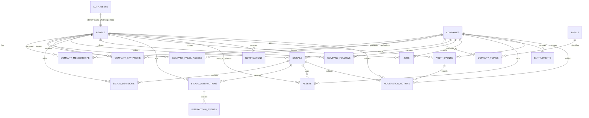
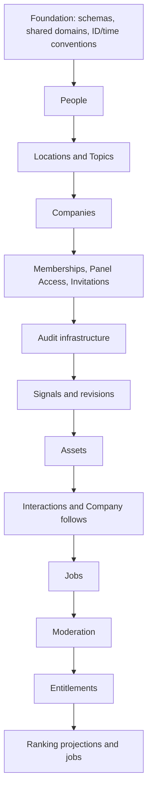

# Conceptual V1 data model

**Implemented now: `public.people` and `public.person_status` only. Everything else in this document is future schema.** This remains a dependency and ownership model, not permission to implement later entities early.

## Core entity contracts

| Entity | Purpose and key conceptual rules |
| --- | --- |
| `auth.users` | Supabase-owned canonical authentication identity. |
| `people` | **Implemented in Cycle 00D.** Public Clauble identity; zero-or-one Person per `auth.users` row with the same UUID; states `active`, `suspended`, `deactivated`, `deleted`; route `/u/{username}`. Auth deletion is restricted while the Person exists. |
| `companies` | Public Company identity; states `draft`, `active`, `suspended`, `deletion_pending`, `archived`; route `/c/{slug}`. |
| `company_memberships` | Public Person–Company history; roles `Founder`, `Member`; states `active`, `left`, `removed`; never `invited`. Conceptual fields: `id`, `company_id`, `person_id`, `public_role`, `job_title`, `state`, `starts_at`, `ends_at`, `created_at`, `created_by`. |
| `company_panel_access` | Private authorization; roles `Owner`, `Admin`, `Editor`, `Analyst`; states `active`, `revoked`; absent active row means no access. Conceptual fields: `id`, `company_id`, `person_id`, `panel_role`, `state`, `granted_by`, `granted_at`, `revoked_by`, `revoked_at`. |
| `company_invitations` | Pending intent targeting an existing Person; states `pending`, `accepted`, `declined`, `revoked`, `expired`. Conceptual fields: `id`, `company_id`, `target_person_id`, `proposed_public_role`, nullable `proposed_panel_role`, nullable `job_title`, `invited_by`, `status`, `token_hash`, `expires_at`, `accepted_at`, `revoked_at`, `created_at`. Contains only a token hash if tokenized. |
| `topics` | Platform-controlled canonical taxonomy; only active Topics are selectable by Company management. |
| `company_topics` | Many-to-many Company classification; selection is authorized, taxonomy creation/merge is admin-only. |
| `signals` | Company-owned publication; every published row has `company_id` and `author_person_id`; route `/s/{snowflake-id}`. Tracks creator/publisher/editor audit references. |
| `signal_revisions` | Durable revision/draft history if the future physical design separates it from `signals`. |
| `audit_events` | Append-only security and domain history; restricted Company/platform visibility. |

Other conceptual entities support follows, interactions, jobs, assets, notifications, entitlements, and moderation; their detailed fields require later product cycles.

## Conceptual ERD



`AUTH_USERS` denotes Supabase `auth.users`; all other names denote conceptual future Clauble entities. Polymorphic audit/moderation targets are shown conceptually and do not approve a particular foreign-key implementation.

## Signal ownership and history

```text
Company --owns--> Signal
Person  --authors--> Signal
```

Every published Signal requires `company_id` and `author_person_id`. Company ownership controls publication and workspace lifecycle. Person authorship supplies durable credit. A Person leaving or losing panel access does not delete or rewrite prior authorship. Audit separately records `created_by`, `published_by`, and `edited_by`. V1 has no personal Signals.

## Invitation transition

Acceptance performs one logical transaction:

```text
pending company_invitation
          |
          | validate target, status, expiry, inviter authority
          v
active company_membership
          +---- optional active company_panel_access
          +---- accepted invitation state
          +---- audit event
```

Uniqueness/idempotency must prevent duplicate active membership and panel-access rows. Revoked, expired, declined, or already-accepted invitations cannot create new access. A proposed Founder role and a proposed panel role remain independent.

## Data classification and schema exposure

| Class | Examples | Future schema/exposure rule |
| --- | --- | --- |
| Public | active Person profile, active Company profile, active membership, published Signal, active Topic | Approved public fields/projections may be in exposed `public` (or future `api`) with explicit `anon`/`authenticated` SELECT grants and RLS. Underlying non-public columns must not leak through broad SELECT. |
| User private | email, account/security state, saved Signals, notification preferences | Auth email/security remains in Supabase-managed `auth`; app-owned private data is exposed only if direct user access is required, with authenticated least-privilege grants and self-only RLS. Never grant `anon`. |
| Company private | panel role, drafts/revisions, private workspace state, invitations, Company audit history | Prefer unexposed `private` for server/internal-only data. If direct client access is justified, expose only a reviewed table/view/RPC with `authenticated` minimum grants and Company-current RLS; never `anon`. Token hashes remain unexposed. |
| Restricted platform | moderation evidence, abuse signals, admin actions, security events | Unexposed `private`/future restricted schema only. Access through narrowly scoped trusted platform services; no routine `anon` or `authenticated` Data API grants. |

The physical schema boundary is partly OPEN: current configuration exposes `public`; a dedicated `api` schema may later reduce the review surface. Regardless of schema name, no new object is reachable until explicitly granted.

## Recommended migration order

Foreign-key direction and authorization dependencies produce this order:



Rationale and dependency notes:

1. Foundation fixes schemas and shared conventions without product tables.
2. People depends only on `auth.users` and is referenced by nearly every actor/creator field.
3. Topics/locations are independent reference data needed by Companies.
4. Companies depends on People for creator/launch context and reference taxonomies as approved.
5. Membership/access/invitations depend on both People and Companies and establish authorization source-of-truth.
6. Audit comes after actor/Company identity; high-risk later mutations must not ship before it. A minimal audit table could be included with the access stage if ownership transfer ships there.
7. Signals depend on Companies, People, access permissions, and audit.
8. Assets should follow owners/consumers so ownership references are concrete.
9. Interactions/follows require People plus public Company/Signal entities.
10. Jobs depend on Companies, People, permissions, and possibly assets.
11. Moderation depends on all target types and audit.
12. Entitlements attach to established subjects but remain separate from ranking.
13. Ranking projections/jobs are last because they consume stable public content and interaction events; premium entitlements never alter organic ranking.

This order is a planning dependency graph, not permission to combine it into one migration.
